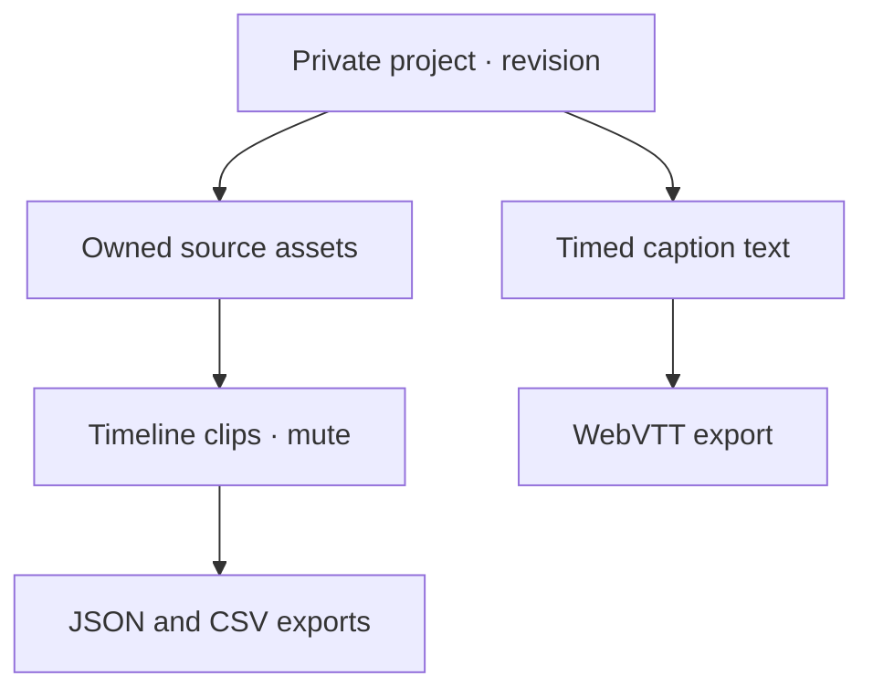

# Creator Project Graph v1 — 2 October 2026

This change builds on main `a9aa2779f59f59e1eb30753bdc9edb6c58a912b8`, including Claude's existing asset, storage, generation, profile, commerce, call, recurring-work and subscription modules. It implements a reachable project workspace, not the entire requested enterprise, social, media and device roadmap.

## Implemented paths

| Customer action | Destination | Result |
| --- | --- | --- |
| Open Creator projects | `/creator-studio/projects` | List the latest 100 projects; create a private project |
| Edit a project | `/creator-studio/projects/:id` | Attach owned assets, arrange timeline clips, mute clips, add timed caption text, remove entries, archive/restore |
| Create | `POST /api/creator-studio/projects` | Persistent `creator_projects` row |
| Edit | `POST /api/creator-studio/projects/:id/commands` | Atomically replace the validated graph only at the expected revision |
| Export | `GET /api/creator-studio/projects/:id/export/:format` | JSON manifest with SHA-256, multi-cue WebVTT, or CSV edit list |
| Discover projects | Creator dashboard, workspace directory, content-project catalog | Links to the actual project workspace |

The module concentrates graph validation, derived edges, clip timing, mute state, caption encoding and deterministic exports at one interface. The persistence adapter concentrates organization resolution, source validation and optimistic concurrency. Routes and tests cross those same seams. This gives callers leverage without copying validation into each form, and keeps corrections local to the graph module.

`creator_assets` and its existing private attachments remain the source library. No second file storage system is introduced. Each source is checked against the resolved organization on mutation and export. Source durations are user declarations, not analyzed file metadata. Captions use explicit user text, not speech recognition. Clip exports describe edits; no video/audio rendering or distribution is claimed.

## Database and authorization

`20261002090000_creator_project_graph.sql` creates one project row containing a versioned JSON snapshot, a positive revision, timestamps and archival state. A single compare-and-update avoids partially saved multi-table graphs. Source-to-clip edges are derived rather than trusted from input, preventing cycles and dangling clip references. Remove dependent clips before removing their source.

RLS permits authenticated members to read their organization's projects. Anonymous reads and direct authenticated writes are revoked. Only the validated server module writes through the service role; every request also includes the server-resolved organization filter. Graph entries never store provider credentials, file bytes, card data or raw device permissions. The server context is removed from every response.

Both new catalog migrations are additive. The old September catalog migrations are retained unchanged and frozen; the generator now targets the October files. Do not edit or regenerate applied migrations in place.

## Exactly fifteen public tools

| Company | Four public tools, except three for the parent |
| --- | --- |
| SONARA Industries / SONARA One | Data formatter, text fingerprint, storage budget |
| Business Builder | Break-even/runway, stock reorder, offer builder, pricing calculator |
| Creator Studio | Rate card, split sheet, creative brief, release checklist |
| Growth Studio | Campaign budget, referral reward, campaign outline, KPI calculator |

Studio computation and results are anonymous; account saving remains optional. The parent tools at `/tools` process input on the device, perform no upload, expose the result immediately and offer a JSON download. Input edits clear stale results/downloads. JSON numbers outside safe precision are refused. Parent tools do not persist private text in browser storage. Remaining studio tools keep subscription checks. These are the public tool catalogs; account-only record editors and provider workflows are separate workspace capabilities.

The graph has no sales quote, special intake gate, provider dependency or extra purchase. Existing optional provider generation remains governed by its configuration, consent, approval and usage ledger. The follow-up in `INCLUDED_GENERATION_AND_LOCAL_PROCESSING.md` renews the existing generation allowance with verified subscription periods and reserves concurrent jobs atomically. Other metered services and large marketplace/broadcasting execution still need their own operational integrations.

## Research converted into implementation

- `docs/research/CREATOR_STUDIO_MARKET_ADVANCEMENT_2026-09-22.md`: persistent projects, explicit transcript/timeline, portable handoff.
- `lib/sonara-market-expansion-schema-plan.cjs`: extend existing assets/storage rather than parallel subsystems; expected-version conflict handling.
- `lib/sonara-screenshot-tool-radar-batch19.cjs`: typed deterministic decisions, inspectable provenance, explicit media retention.
- Existing `lib/sonara-deterministic-media.cjs`: reusable deterministic media principles, extended here to multiple timed cues.
- [W3C WebVTT](https://www.w3.org/TR/webvtt1/): UTF-8 cue timing and plain-text encoding.
- [PostgreSQL row security](https://www.postgresql.org/docs/17/ddl-rowsecurity.html): member-scoped reads and separate write privileges.
- [MDN media permissions](https://developer.mozilla.org/en-US/docs/Web/API/MediaDevices/getUserMedia): camera/microphone use requires browser permission and a secure context. No permission is silently widened by this change.

No screenshot code, unverified model, unlicensed repository or third-party media was imported. The generated capability inventory maps the entire current checkout and preserves research-only status. Source references are evidence and direction, not enabled runtimes.

## Remaining implementation sequence

| Area | Existing foundation | Work still required |
| --- | --- | --- |
| Creator generation | Provider Gateway, generation jobs, private generated assets, usage ledger | Canonical tenant-safe job/project linking, recurring included allowance, provider execution and failure evidence |
| Media production | Project clips/captions, WAV/VTT outputs, workflow plans | Real preview/render workers, metadata probing, revision history, import/interchange, cancellation/retry and device tests |
| Creator marketplace | Offers, catalog, storage, connected payment modules | Buyer checkout, immutable license/delivery grants, entitlement verification and seller lifecycle |
| Business Builder stores | Merchant records, payments, bookings, work orders, invoices, inventories | Per-business storefronts, complete buyer flows, industry packs and production evidence |
| Growth community | Profiles/follows, campaigns, consent, leads, calls | Moderation/report/block/appeal, feed/post/comment model, event/RSVP/ticket flows, broadcast/radio and abuse operations |
| Device processing | Existing device preference and explicit microphone/location paths; new local public tools | IndexedDB workspace isolation/clearing, offline mutation reconciliation, WebGPU/CPU fallback, camera/contact permission flows, browser/mobile proofs |
| Independent product operations | Separate workspace routes with shared identity/billing/storage | Product-specific service health, support, exports, recovery drills and standalone operation proof |
| Research adoption | Governed register and product placement | Verify upstream identity, license, compatibility and tenant/cost/security behavior per selected adapter before production promotion |

These rows are implementation work, not live capability claims or fake product buttons. Heavy rendering, public broadcasts, external posts, payments, GPU access and contacts cannot be enabled merely by adding route names.

## Verification and activation

Local dependency installation, moderate-level audit, typecheck, lint, build, API/route/database contracts and the full Mocha suite were run. Graph tests exercise sources, invalid timing/links, deterministic exports, server-context redaction, cross-tenant rejection, stale-write races, missing sources and archive/restore. Browser tests cover local parent-tool outputs, no upload, unsafe-number refusal, stale results and mobile overflow.

An isolated PGlite PostgreSQL/WASM probe executed the new graph migration twice, checked member/anonymous/read/write privileges, missing-key constraints and revision compare-and-update. That probe uses minimal prerequisite schemas and the existing membership helper; it is not the complete migration replay or hosted Supabase proof.

Local Chromium downloads were incomplete. Native PostgreSQL binaries were downloaded/extracted, but this environment cannot switch to an unprivileged OS user and `initdb` refuses root. Full native migration replay and rendered browser validation must pass in CI. Production migration application, deployment, real subscription unlock and two-tenant live checks are separate outstanding activation steps. Do not report this workspace as live until those steps succeed.
