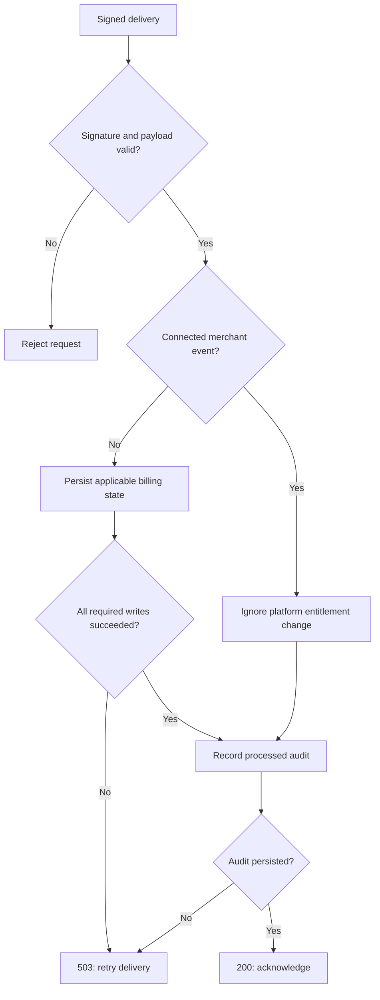

# SONARA second-pass advancement and implementation assessment

Reviewed 4 October 2026. Starting revision: bc57a91ae2671d604753fc013a4b7437e0769238. This review builds on the merged market-focus and device-processing work. Read it alongside [the full business and competitor assessment](SONARA_CAPABILITIES_MARKET_FOCUS_2026-10-04.md) and [device and forecast verification](../architecture/DEVICE_PROCESSING_AND_FORECAST_VALIDATION_2026-10-04.md). Source implementation, local verification and deployed customer behavior are separate evidence levels.

## Business, operating system and market position

SONARA Industries is the parent; SONARA One is the shared application platform; Business Builder, Creator Studio and Growth Studio are product lines. The platform is a business application operating system, not a kernel or a replacement for Windows, Linux, Android or iOS. Its advantage could be continuity: a customer inquiry becomes operational work, approved evidence becomes media, and authorized follow-up becomes measurable repeat business. The repository proves components of that workflow, not profitable adoption or market leadership.

The recommended first market remains owner-operated cleaning and property-service businesses with 1–10 people. This is an experiment, not established product-market fit. Narrow the buyer, acquisition message, default workspace and industry templates while retaining broader capabilities in shared modules. Parent positioning: **Run the work, create the proof, grow repeat business.** Sell outcomes rather than a catalogue of hundreds of tables and routes.

| Product | First buyer and job | Competitive comparison | Improvement that matters |
| --- | --- | --- | --- |
| Business Builder | Small service operator managing repeat jobs | Jobber, service-management platforms and parts of Zoho One | Reliable quote-to-job-to-payment reconciliation; understandable receivables; scoped customer records |
| Creator Studio | Operator or freelancer producing approved proof of work | Descript and specialist media tools | Fast, consented capture-to-export; reusable branded assets; honest supported-device limits |
| Growth Studio | Same operator or small agency pursuing repeat bookings | HighLevel, Buffer and CRM/marketing tools | Approved follow-up connected to completed jobs and settled transactions; incremental-outcome experiments |
| Parent platform | Operator seeking continuity across these tasks | Suites and combinations of the above; Shopify for retail adjacency | Fewer handoffs, consistent permissions, explainable calculations and auditable payments |

Do not claim feature parity with specialist CAD, DAWs, enterprise accounting or clinical systems. Broad adjacency remains available without becoming the acquisition message. A durable advantage requires measured customer effort, reliable delivery and repeat usage, not integration count. Competitor feature and pricing sources remain in the companion report; no market-share or current revenue estimates were invented.

## Current strengths, weaknesses and conversion into improvements

| Evidence | Strength or weakness | Conversion strategy and status |
| --- | --- | --- |
| Shared organization and product boundaries | Reusable platform; many integration seams | Preserve shared modules and enforce tenant linkage. New invoice/payment database constraint is included in this branch |
| Deterministic formula evaluators | Reproducible arithmetic with bounded inputs | Six additional business/media formulas are already merged; require units and domain assumptions for every subsequent formula |
| Local camera, microphone and image paths | Useful privacy-conscious device processing | Already merged opt-in capture and bounded image processing; still needs physical-device qualification |
| Forecast holdout against naive baseline | Better evidence than fitting and scoring on the same observations | Already merged chronological evaluation; do not describe it as guaranteed forecasting |
| Billing webhook previously acknowledged failed persistence | Payment reliability weakness | Implemented retryable HTTP failure and checks for both billing record and entitlement persistence |
| Signature verification previously lacked freshness and key overlap | Replay exposure and key-rotation weakness | Implemented 300-second timestamp tolerance, duplicate-timestamp rejection and acceptance of any valid v1 signature |
| Platform and merchant event scopes shared synchronization entry | Possible scope confusion | Connected merchant events are explicitly ignored by platform entitlement synchronization |
| Invoice-payment tenant fields linked by single-column invoice FK | Database could accept mismatched tenant references | Added composite foreign key for future writes; historical validation remains a separate reviewed task |
| Marketplace lists and verifies readiness but lacks buyer checkout/delivery | Clear gap, not completed commerce | Retain explicit unavailable state; design payment-backed delivery before enabling purchases |
| Hundreds of routes and tables | Breadth but expensive verification and navigation | Audit actual customer journeys and data contracts; reuse existing outbox, purchases, memberships and workspaces before creating more tables |

## Implemented payment behavior

The webhook verifies the exact raw request body before parsing. The signature timestamp is the delivery-attempt timestamp, not the event's creation time; retries may legitimately deliver older events with fresh signatures. One timestamp must be present and within 300 seconds of the server clock. At least one correctly formed v1 signature must match using constant-time comparison. Clock synchronization remains an operational prerequisite.

Authenticated payloads still require an event ID, event type and data object. Subscription synchronization requires both the subscription write and entitlement write to succeed; failed primary writes no longer continue into entitlement writes. Paid checkout synchronization requires a persisted purchase and entitlement. The legacy one-time path also recognizes asynchronous payment-success events; this does not create a new catalogue product or marketplace checkout.

The HTTP handler returns 503 when synchronization fails, allowing Stripe to retry. It records a processed audit only after successful synchronization, and returns 503 when that audit cannot be persisted. Existing conflict keys and event-order database guards remain in place. This is not a distributed transaction: some writes can succeed before another fails. Purchase activity logging is not newly guaranteed exactly once; a retry after an audit failure can repeat that ancillary activity. A future durable idempotent outbox should handle customer delivery and receipts before claiming exactly-once external effects.

Connected-account events cannot grant platform access through either synchronization entry point. They can be recorded as received/ignored by this endpoint; merchant reconciliation needs its own scoped handler and verified connected-account-to-organization mapping. Direct merchant charging and platform subscription billing are different flows.

## Schema and migration boundary

The new migration creates a unique index on `customer_invoices(id, organization_id)` and a foreign key from `customer_invoice_payments(invoice_id, organization_id)`. `NOT VALID` enforces new writes without pretending all historical rows have been examined. It does not remove or repair old records and does not replace authorization policies. Existing nullability remains unchanged; null tenant identifiers would need a separate schema review before tightening.

Before live application: review historical mismatches, measure table size/index-lock impact, back up, replay the full migration history, run two-tenant insert/update cases, and validate the constraint only after resolving reviewed historical violations. Do not silently delete financial history. A production target and deployment evidence were not available in this session; this migration is prepared, not applied live.

No redundant payment, communications or workspace tables were added. Existing event_outbox and event_delivery_attempts should be reused for retryable effects. New routes need an actual customer workflow, ownership, access tests and contracts; more route surface alone is not advancement.

## Deterministic capabilities and real-world formulas

Determinism means the same validated input and version produce the same result. It does not mean input truth, scientific validity or universal superiority over AI. Use deterministic calculation for exact rules and measurements; use models for suitable perception or language tasks, then validate model-derived inputs before consequential calculations.

| Domain | Formula or method | Inputs and output | Scope and status |
| --- | --- | --- | --- |
| Business risk | Expected loss = probability × financial impact | Probability in [0,1], currency amount → expected currency loss | Merged evaluator; decision aid, not an insurance or clinical risk certification |
| Demand | Smoothed level = alpha × observation + (1-alpha) × prior level | Consistent units and alpha in [0,1] → next level | Merged evaluator; holdout forecasting is a separate merged method |
| Capacity | Available productive minutes / minutes per job, floored | Time and job duration → complete-job capacity | Merged evaluator; ignores travel/queue variability unless explicitly included |
| Media | Duration = frames / frame rate | Frame count and frames/second → seconds | Merged evaluator; constant frame-rate assumption |
| Media transport | Duration × bits/second / (8 × 2^20) | Seconds and encoded bitrate → estimated MiB | Merged evaluator; container overhead and variable bitrate require measured correction |
| Tracking | Distance / elapsed time | Same-coordinate-system distance and seconds → speed | Merged evaluator; not a motion-capture or camera-calibration engine |
| Physics | Kinetic energy = mass × speed² / 2 | kg and m/s → joules | Proposed educational module; require SI units and nonrelativistic assumptions |
| Laboratory planning | C1 × V1 = C2 × V2 | Compatible concentration and volume units → stock volume | Proposed research-use calculator; no clinical dosing or biological-effect prediction |
| Rendering | Frames / measured throughput + measured overhead | Benchmark and frame count → planning time | Proposed estimator; throughput depends on codec, hardware and scene |
| Imaging | Width × height × channels × bytes/channel | Dimensions and sample representation → uncompressed bytes | Existing image limits inform planning; estimate does not represent complete peak memory |
| English and social studies | Versioned rubrics, citation provenance and scoring rules | Source evidence and rubric → inspectable assessment | Proposed workflow; factual interpretation is not reducible to guaranteed arithmetic |

CAD/AutoCAD compatibility requires exact format/import/export support, geometric tolerances and specialist validation. Pose tracking requires landmark model, coordinate conventions, confidence handling and camera calibration for metric motion. Audio/video generation requires licensed models, verified compute budgets and provenance. Merely adding a formula or model name does not implement these systems.

## Open-source integration plan

Use the companion report's verified upstream/license register. No blanket installation was performed. Free software can still incur hosting, GPU, support and commercial-compliance costs; Hugging Face model weights and datasets have licenses separate from inference libraries.

| Candidate | Useful expansion | Acceptance condition before activation |
| --- | --- | --- |
| whisper.cpp | Local transcription and captions | Pinned MIT implementation plus compatible weights; consent, language accuracy, latency and device tests |
| ONNX Runtime / Transformers.js | Bounded local inference adapters | Verify exact version, execution provider, model license, memory and output quality |
| MediaPipe pose | Optional visual landmarks | Supported device tests, consent, confidence thresholds; never claim metric biomechanics without calibration |
| FFmpeg | Worker-based probing, transcoding and rendering | Review chosen build's LGPL/GPL/nonfree configuration; isolated jobs, timeouts, file limits and export tests |
| LiveKit | Real-time session infrastructure | Transport, TURN, authentication, reconnect and retention tests; service cost budget |
| PostgreSQL | Native full-history migration verification | Native toolchain and disposable database, then SQL assertions; installation attempt here was blocked by environment package-manager limitations |

ProviderGateway, job allowances, provenance and rights rules remain the integration boundaries. Pin source and artifacts; record inputs, output, version, elapsed time, failures and license evidence. Benchmark against the present workflow before declaring an improvement.

## Ordered development plan

1. Finish payment failure-path and tenant-link verification. Replay migration history in native PostgreSQL and run exact-head CI before merging/deploying.
2. Complete the first vertical journey: inquiry, quote, job, invoice, verified settlement, consented asset, approved follow-up. Use existing schemas and expose setup-required states honestly.
3. Implement durable marketplace delivery: server-priced immutable listing/version, verified merchant scope, Checkout Session creation with stable idempotency keys, paid webhook, unique purchase grant and private signed-file access. Handle expired checkout, asynchronous failure, duplicate delivery, refund/revocation and seller disconnection. Never put a payment button on a statement-only shared invoice token.
4. Reuse the event outbox for authorized communications. Persist intent before dispatch, deduplicate by business event and recipient/channel, record attempts and provider IDs, retry boundedly, and respect consent/opt-out. Do not send customer campaigns simply because a payment event arrived.
5. Add one bounded media adapter after consent, licenses and measured quality pass. Keep deterministic calculations available when a provider is unavailable.
6. Pilot with 15 interviews and five paying operators; seek four retained paying pilots after 60 days. Measure successful jobs, settlement reconciliation, export completion, support burden and repeat booking. These are proposed experiment targets, not results.

For competitors, compare the same tasks and devices: time to first successful job; percentage of payment events reconciled within the target interval; export success; support minutes per operator; repeat paid usage. Marketing should describe measured superiority on a chosen task, not guaranteed domination. Preserve scope, but concentrate investment until a customer repeatedly pays for the integrated outcome.

## Verification and remaining risks

Regression tests cover fresh/old/future signatures, overlapping keys, duplicate timestamp rejection, connected-account exclusion and required billing persistence. After incorporating main revision 05943b3fed2ad8467d58adddd9d412773dda87ba (device Worker origin protection), the final full suite passed 5,958 tests with six pending. Frozen installation, moderate vulnerability audit (no known vulnerabilities), typecheck, lint, build, client-secret scan, database/schema and tenant-query checks, migration checksums, generated capability/handoff checks and module/factory reachability passed. These are local results, not exact-head CI or live production certification. A native PostgreSQL installation was attempted; package discovery failed and package-list refresh could not change identities in this environment. The replay command therefore must not be represented as a native SQL pass. No live Stripe charge, customer communication, production migration or physical-device test was executed here.

Residual risks include non-atomic billing writes, ancillary activity duplication, historical tenant mismatches, external provider setup, device variation, customer consent, resource costs and unproven commercial demand. Invoice enforcement is partial until historical validation. The safest advancement is fewer unsupported promises and stronger end-to-end evidence.

## Primary research sources

- Stripe webhook signatures, retries and endpoint behavior: https://docs.stripe.com/webhooks
- Stripe Checkout fulfillment and asynchronous payments: https://docs.stripe.com/checkout/fulfillment
- Stripe Connect event scope: https://docs.stripe.com/connect/webhooks
- Stripe direct charges: https://docs.stripe.com/connect/direct-charges
- Stripe request idempotency: https://docs.stripe.com/api/idempotent_requests
- PostgreSQL license: https://www.postgresql.org/about/licence/
- Competitor and media/model license references: companion capability/market report.
