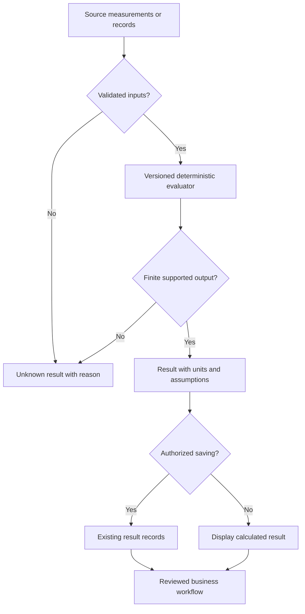

# SONARA third-pass capability, business and implementation assessment

Reviewed 4 October 2026, America/New_York. Starting point: the tested second-pass branch, including main through 05943b3. PR #428 is a dependency, not assumed merged or deployed. This report extends [the full market assessment](SONARA_CAPABILITIES_MARKET_FOCUS_2026-10-04.md) and [payment infrastructure assessment](SONARA_SECOND_PASS_PAYMENT_INFRASTRUCTURE_2026-10-04.md). Inventory breadth is not customer acceptance evidence.

## What the business and application are

SONARA Industries is the parent company. SONARA One is its shared application operating system. Business Builder, Creator Studio and Growth Studio are the customer product lines. This is a browser/server application with permissions, records, workflows, payments, media and optional governed providers. It does not provide an independent kernel, universal hardware privileges, device drivers or a replacement desktop/mobile operating system.

The repository supports a potentially useful continuity: operational work generates records; consented evidence becomes reusable media; authorized distribution and follow-up connect to business outcomes. That continuity is the proposed differentiator. It is not yet a demonstrated moat, enterprise deployment track record or established market share.

The third-pass inventory records 921 route operations, 353 declared tables and 152 migration files. The main deterministic library now has 59 formula definitions, with the separately maintained financial formulas remaining separate. These counts describe source scope, not how many capabilities are fully deployed, configured or proven on customer devices.

## Capability and maturity matrix

| Area | Implemented source capability | Current practical limit | Next acceptance evidence |
| --- | --- | --- | --- |
| Shared platform | Organization workspaces, membership/access guards, records, product navigation and billing contracts | Latest deployed revision and full customer journey are not verified here | Real account, two-tenant isolation, entitlement lifecycle, backup/restore |
| Business Builder | Jobs, customers, quotes/invoices, merchant records, scoped payment-account readiness | Full merchant settlement/reconciliation and supported POS devices remain incomplete | Quote-to-job-to-invoice-to-verified-payment pilot |
| Invoice arithmetic | Deposits, net recorded receipts, remaining balance and overpayment display | Recorded payments are not a bank or Stripe settlement reconciliation | Provider-to-ledger match, refunds/disputes, currency/time window and independent balance tests |
| Creator Studio | Project graph, version/approval records, timeline/media tools, bounded local capture and image processing | Heavy rendering, supported physical devices and professional editor parity are unproven | Real-device export success, memory/latency and private-storage tests |
| Creator marketplace | Rights/consent/listing checks, immutable version reference and public catalogue | Buyer checkout and payment-backed private delivery remain unavailable | Verified purchase, one durable grant, private signed delivery, refund/revocation tests |
| Growth Studio | Leads, campaigns, market evidence, channels, feeds and governed execution contracts | Broad social connector execution and causal revenue attribution are incomplete | Approved dispatch, retries/deduplication and linked incremental-outcome experiment |
| Communications | Push subscription/consent infrastructure and invoice-paid event join | Not universal email/SMS/social connectivity or exactly-once dispatch | Provider failure/recovery, opt-out and concurrent event tests |
| Deterministic science/media | Validated equations and explicit units through existing formula routes | Formula correctness does not establish input truth or specialist certification | Reference cases, property tests, units and domain-specific acceptance |
| Optional AI/model adapters | Provider gateway, usage/authorization and provenance contracts | Model records are not activated adapters; weights, compute and credentials still matter | License, quality, cost, privacy and failure evidence per model |

A signed payment notification is not a bank settlement statement. A local image processor is not unlimited GPU rendering. A saved consent record is not browser camera permission. A physical formula is not motion capture, CAD or clinical intelligence.

## Concrete implementation in this pass

### Exact and uncertain invoice amounts

`sonara-invoice-settlement.cjs` now accepts safe integer cents and strictly written integer strings, retaining signed corrections. Booleans, fractions, exponent strings, whitespace, objects and unsafe integers are refused as amounts. BigInt accumulates valid payments exactly; an aggregate outside JavaScript's safe integer range is unverified. Unsafe differences are also refused.

An unreadable row cannot be assumed to increase payments: a correction may be negative. Therefore any unreadable amount produces `unknown`, null balance figures and `certain: false`, rather than a numerical upper bound that is not justified. Malformed payment collections likewise remain unknown. Negative/invalid invoice totals are treated as unpriced. No records are changed, no refund occurs and no payment is generated by this calculation.

The invoice-paid notification now requires verified before/after settlements. An unreadable correction accompanying a covering payment produces `balance_unverified` and sends nothing. Existing explicit notification preferences remain authoritative. Concurrent writes and exactly-once notification persistence remain separate work; this change is a truthfulness boundary, not a complete notification queue.

This affects existing users of the settlement module, including statements, invoice PDFs and receivable views, without adding another disconnected route or duplicating financial tables.

### Six bounded formulas

| Formula key | Equation | Units/inputs | Reference result and assumption |
| --- | --- | --- | --- |
| kinetic_energy_joules | E = m v² / 2 | kg, meters/second → joules | 30 kg at 0.5 m/s = 3.75 J; translational/nonrelativistic only |
| dilution_stock_volume | Vstock = Ctarget Vfinal / Cstock | Compatible concentration units; same volume units | 10-unit stock to 2-unit target in 100 volume units requires 20 stock units; target cannot exceed stock |
| render_time_estimate_seconds | t = frames / measured fps + overhead | Whole frames, positive measured frames/second, seconds | 300 frames at 25 fps plus 3 seconds = 15 seconds; comparable measured workload, not a performance guarantee |
| uncompressed_image_bytes | B = width × height × channels × bytes/channel | Whole sample dimensions/representation → bytes | 1920×1080×4×1 = 8,294,400 bytes; packed payload, not total process/GPU memory |
| average_acceleration | a = (vfinal − vinitial) / elapsed time | Signed calibrated m/s and positive seconds → m/s² | 4 to −2 m/s over 3 seconds = −2 m/s²; interval average, not instantaneous biomechanics |
| rectangle_area_square_meters | A = length × width | Nonnegative rectangular dimensions in meters → m² | 3×4 = 12 m²; not CAD geometry or format compatibility |

Bounds include 8192 pixels per image side, 1–4 channels and 1–8 bytes per channel. Physics velocities are bounded at 1,000,000 m/s in magnitude and mass at 10¹² kg; domain limits are operational validation, not a certificate of a measurement's accuracy. Dilution is educational/research planning, not clinical dosing or a biological-effect prediction. Existing result rounding remains four decimal places; do not use rounded outputs where a domain requires higher precision.

All six use the existing formula engine and `/api/formulas/evaluate`; existing routing, organization permissions and result-saving paths remain in place. No new specialist application or artificial public free-tool slot was added.

### Formula database catalog migration

Saved results reference `sonara_formula_definitions(formula_key)`. The six prior business/media formulas were in runtime code without a matching new database seed, so calculation availability did not establish persistence availability. The new migration inserts those six and this pass's six into the existing catalog. It preserves existing definitions with `ON CONFLICT DO NOTHING`, and changes no grants or customer records. Existing group foreign keys remain required.

This is a prepared migration, not proof of live application. Native full-history replay and production target checks remain necessary. A runtime definition and a stored catalog can still drift if a preexisting conflicting row differs; audit that catalog during deployment rather than treating `DO NOTHING` as a synchronization guarantee.

## Architecture and input/output blueprint

Optional perception models should feed this boundary as attributed estimates, not silently trusted measurements. For motion, record model/version, camera calibration, coordinate system, confidence and time base before computing metric velocity or acceleration. For English/social studies, use source citations, versioned rubrics and human interpretation rather than pretending every semantic question has a guaranteed numerical answer. For biology, enforce research-purpose units and assumptions; do not infer diagnosis or treatment from these calculators.

## Competitive research and a narrow market thesis

Current primary-source review confirms Jobber offers cleaning-oriented scheduling, quoting, invoicing, payments and client communication. Its client hub supports quote interaction and customer payments. HighLevel advertises CRM, workflows and multichannel follow-up, with a published $97/month starter price and additional plans. Descript offers text-based audio/video editing and a free entry plan. These are established workflow competitors, not just feature checklists to copy.

| Product/parent | Recommended initial buyer | Competitor strength | SONARA opportunity and proof required |
| --- | --- | --- | --- |
| Business Builder | Owner-operated cleaning/property service, 1–10 workers | Jobber's focused end-to-end service operations | Accurate, simple job/receivable workflow connected to approved media; prove payment correctness and less operator effort |
| Creator Studio | Same operator or their freelance media partner | Descript's transcription-led editing | Reusable proof-of-work assets anchored to real jobs and independent consent; prove capture/export speed and supported quality |
| Growth Studio | Same operator or small service-business agency | HighLevel's communication/automation suite | Authorized follow-up tied to operational events and paid repeat business; prove deliverability, opt-out and incremental outcomes |
| SONARA Industries | Cost-sensitive operator seeking a connected workflow | Suites and assembled specialist tools | Fewer handoffs and consistent records/permissions; prove retention and total cost of operation |

Inference: cleaning/property services remain a practical first hypothesis because repeat jobs, straightforward capacity, before/after evidence and repeat bookings fit the shared infrastructure. This review does not demonstrate their willingness to pay. Keep all capabilities; narrow the initial offer, default dashboard, templates, documentation and outreach. Sell **Run the work, create the proof, grow repeat business.** Each child product can have standalone buyers while supporting that shared workflow.

Do not compete by promising universal AI superiority, every industry at launch or market domination. Compete on a measured outcome: fewer failed exports, verified balances, less double entry, shorter time to first completed job and more retained paying use. Expand to adjacent trades/retail only after the first vertical reliably pays and returns.

A 60-day experiment remains 15 interviews, five paying pilots and a target of four retained paying pilots. Track activation, completed jobs, payment matching, export success, approved follow-up and support minutes. These are proposed targets, not customer results.

## Strengths, weaknesses, pros and cons

| Current property | Benefit | Cost/risk | Conversion into a strength |
| --- | --- | --- | --- |
| Broad reusable platform | Many adjacent workflows without rebuilding fundamentals | Large verification/navigation burden | Vertical onboarding and measured end-to-end paths |
| Deterministic calculations | Inspectable, reproducible outputs | Wrong units/data can yield confidently wrong answers | Explicit units, domains and unknown results; implemented here |
| Shared financial records | Continuity across operations and billing | Tenant mismatch, partial writes and unverifiable totals | Prepared tenant-link constraint, retryable webhook writes and verified arithmetic across passes |
| Local media processing | Useful control/privacy and less server computation | Device variation and bounded capacity | Device qualification, limits and progressive enhancement |
| Rights/consent marketplace gates | Reduced unsupported selling and provenance risk | Checkout/delivery not complete | Preserve unavailable state until verified purchase and private access are implemented |
| Low subscription entry hypothesis | Accessible to cost-sensitive operators | Support/media/provider costs may consume margin | Meter resource-heavy jobs and measure support burden; no unlimited-generation promise |
| Optional open-source/model ecosystem | Less dependence on one provider | License, maintenance, compute and security burden | Pin exact upstreams and evaluate one adapter at a time |
| Early market evidence | Freedom to specialize | No proven traction or market position | Paid cohort evidence before expansion claims |

## Open-source, Hugging Face and GitHub advancement

The current upstream licenses for whisper.cpp and ONNX Runtime are MIT. Hugging Face documents model cards and repository licenses; a compatible inference library does not establish a model/dataset license or its suitability for customers. No new model runtime was installed into the application in this pass. Frozen application dependencies were verified; the formula and reconciliation changes require no new dependency.

| Candidate | Implementation blueprint | Activation gate |
| --- | --- | --- |
| whisper.cpp | Bounded transcription worker → reviewed captions → project graph | Pinned source/weights, consent, language error rate, latency and deletion tests |
| ONNX Runtime | Local or isolated model adapter behind job/provenance contracts | Exact model license and artifact hash, memory budget and representative evaluation |
| MediaPipe pose | Optional landmarks → calibrated coordinate/time records → formulas | Confidence, supported camera/device, calibration and privacy tests |
| FFmpeg | Isolated probe/transcode/render workers with deterministic presets | Verify exact build/license configuration, input/time limits, storage and export recovery |
| PostgreSQL | Disposable native cluster replay of full migration history | Actual binary execution and SQL assertions, not text-only checks |

Do not install every research record. Reuse ProviderGateway, allowances, project/version records and event outbox. Report adoption states separately: researched, adapter built, integration tested, production enabled. Free software still has compute, bandwidth, storage, support and licensing responsibilities.

## Commercial and cost model

Use the runtime's actual workspace/All Three/Team ladder and verified Stripe Price objects at checkout; this pass does not change pricing. Revenue is not profit. Budget authentication/database hosting, app hosting, storage/egress, transactional messages, payment fees, model jobs, support, monitoring, backups, taxes and founder time.

Scenario only, not a vendor quote or forecast: suppose realized monthly revenue is $59 per customer, variable service cost is $10/customer and fixed operating expense is $300/month. Contribution is $49/customer and infrastructure-only break-even is ceil(300/49) = 7 customers. At 10 customers the remaining contribution after those assumptions is $190; at 100 it is $4,600. Neither is net profit because founder wages, acquisition, taxes, refunds and unmodeled costs are excluded. Replace assumptions with measured bills before making a financial decision.

Customer value can be tested as `(hours saved × customer hourly value + incremental gross profit − fee) / fee`; separate saved time from causal revenue. Track acquisition payback as acquisition cost / measured monthly contribution, and cohort retention rather than optimistic perpetual lifetime estimates. Zero commission marketplace policy means marketplace transaction volume does not automatically produce SONARA commission revenue.

## Remaining delivery plan and risks

1. Apply the dependency/release gates for PR #428 and this branch; execute native SQL, verify historical invoice tenant linkage and confirm live formula catalog rows before activating saved results.
2. Finish provider-to-invoice reconciliation: scoped connected-account mapping, exact currency/amount comparisons, duplicate event/order handling, partial settlements, fees, refunds and disputes. No bank-reconciliation claim follows from integer arithmetic alone.
3. Build marketplace checkout and private delivery together: immutable version/price/license snapshot, supported merchant account, stable Checkout idempotency key, verified paid webhook, one durable purchase grant and private short-lived file access. A redirect is not payment evidence. Refunded/disputed/revoked access requires explicit policy/owner review.
4. Reuse durable outbox/attempt tables for authorized communications, deduplicate by event/recipient/channel, respect preferences/opt-outs and record bounded retries. Do not automatically launch campaigns from financial events.
5. Qualify real Android/iOS/browser devices for capture/export, permission denial/revocation, low-memory limits and accessibility. Emulator/browser tests do not establish physical-device support.
6. Validate paid demand and retention before broadening the market thesis. This report cannot manufacture customer adoption or guaranteed market leadership.

Local verification passed 5,977 tests with six pending, frozen installation, moderate vulnerability audit (no known vulnerabilities), typecheck, lint, build, database/schema and tenant checks, secret scan, migration checksums, generated inventory/handoff checks and module/factory reachability. These results do not certify exact-head CI or production.

The package index refresh and writable-cache attempt unpacked PostgreSQL 16 binaries. Package configuration remained unsuccessful because this environment cannot switch identities. Native replay then exposed an existing harness bug: assuming the `nobody` user's group is also called `nobody`; Ubuntu uses `nogroup`. A separate minimal commit resolves the actual numeric user/group IDs. Replay remains BLOCKED at ownership changes to UID/GID 65534, which this environment rejects. PostgreSQL never started and no migration SQL was executed. Partially configured development packages are not an application dependency or production installation.

No live charge, customer communication, production migration, physical-device qualification or customer-retention result was performed or fabricated. PR #428 remains an explicit dependency until its release gates and merge complete.

## Primary references

- Jobber cleaning workflows: https://www.getjobber.com/industries/cleaning-business-software/
- Jobber client hub: https://www.getjobber.com/features/client-hub/
- HighLevel pricing/features: https://www.gohighlevel.com/pricing and https://www.gohighlevel.com/
- Descript editing: https://www.descript.com/ and https://www.descript.com/pricing
- OpenStax kinetic energy: https://openstax.org/books/college-physics-2e/pages/7-2-kinetic-energy-and-the-work-energy-theorem
- OpenStax dilution/molarity: https://openstax.org/books/chemistry-2e/pages/3-3-molarity
- Stripe payment fulfillment: https://docs.stripe.com/checkout/fulfillment.md?payment-ui=stripe-hosted
- Hugging Face model cards/licenses: https://huggingface.co/docs/hub/model-cards
- whisper.cpp license: https://github.com/ggml-org/whisper.cpp/blob/master/LICENSE
- ONNX Runtime license: https://github.com/microsoft/onnxruntime/blob/main/LICENSE

Recheck external facts by 18 October 2026. Competitor marketing claims are descriptions of their advertised products, not independently measured outcomes.
